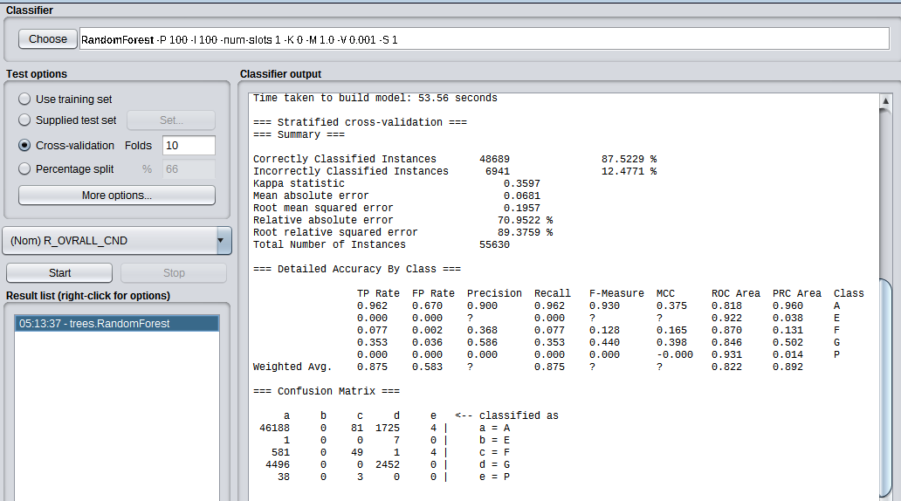

```{r setup, include=FALSE}
knitr::opts_chunk$set(echo = TRUE)
```

## Introduction

Boston is a historical and one of the oldest cities in the United States. Along with it comes super old buildings in and around the greater boston area. As much as we love the old-new building architecture along Boston, it's very important that we also make sure the living conditions and the standard of residential and commerical buildings are upto the mark. If we look at the apartment buldings along the famous commonwealth avenue, we can notice that majority of these buildings were build around the World War 1 period. That makes it important to constantly collect data to verify that all those bulding are in good to great living standards year after year. 

The property assessment data-set from Boston.gov gives property, or parcel, ownership together with value information, which ensures fair assessment of Boston taxable and non-taxable property of all types and classifications. The data-set is public and published by the Department of Innovation and Technology. The data-set uses a class attribute called residential overall condition (R_OVRALL_CND) to determine the latest available condition of the property. It ranges from Poor to Excellent, splitted into 5 categories. Our task for this project is to model various classification algorithms, classify the data into the 5 categories and come to a meaningful conclusion as to which is most suitable model for this data-set.

Why this data set?

1. It's a publicly available data-set of Boston.

2. The data-set is rich with attributes. The more the data we have, better we are able to understand and solve problems.

3. This would enable us to determine the factors that contribute more to the overall condition of residential apartments in Boston.

4. Ability to make practical use-cases relating to apartment renting, buying etc more streamlined and easier.

## The initial data-set

```{r ,message=FALSE, warning=FALSE}
library(foreign)

InitialData<-read.csv('ast2018full.csv', stringsAsFactors = FALSE)

#Displaying the initial list of 75 Attributes
colnames(InitialData)
```

## Attribute selection and data pre-proccessing 

1. The initial data-set had 75 attributes. Out of the 75 attributes, 30 of them were selected and 45 were removed. Attributes relating to Condo's which started with "S_" and "U_" were removed as the project concentrated on the Residential/Apartment buildings which starts with "R_"" in all attributes.

2. All the NaN values were omitted which reduced the number of rows of the data-set from 172k to 55k.

```{r ,message=FALSE, warning=FALSE}
ProcessedData<-read.arff('ast2018full_processed_1.arff')

RemovedAttributes<-setdiff(colnames(InitialData),colnames(ProcessedData))
#List of Attributes removed from the initial data-set
RemovedAttributes

#List of final 30 attributes used for classification
colnames(ProcessedData)
```

3. StringToNominal filter from weka was used to convert all the string attributes like R_OVRALL_CND, R_HEAT_TYPE etc into nominal attributes. The numeric attributes such as AV_LAND, AV_BLDG etc were converted into numerical fields.

4. InterquartileRange filter was used to detect the outliers and extreme values from the data-set. RemoveWithValues filter was used to remove the identified outliers and extreme values. This allowed us to clearly visualize attributes likes GROSS_TAX which followed skewed right normal distribution.


## Classification Algorithm Selection

The following classification algorithms were used to train and test the data along with the various attribute selections.

1. Naive Bayes from bayes  
2. Random Forest from trees  
3. Decision Table from rules  
4. Ibk from lazy  

## Attribute Selection

The following attribute selection filters were used based on their ranking ability and overall applicability to the dataset.

CorrelationAttributeEval (CAE) - Evaluates the worth of an attribute by measuring the correlation (Pearson's) between it and the class.  
InfoGainAttributeEval (IGA) - Evaluates the worth of an attribute by measuring the information gain with respect to the class.  
CfsSubsetEval (CFS) - Evaluates the worth of a subset of attributes by considering the individual predictive ability of each feature along with the degree of redundancy between them.  
SymmetricalUncertAttributeEval (SUA) - Evaluates the worth of an attribute by measuring the symmetrical uncertainty with respect to the class.  
ClassifierAttributeEval (CLAE) - Evaluates the worth of an attribute by using a user-specified classifier.


### 1. CorrelationAttributeEval

The top 10 ranked attributes by CorrelationAttributeEval:

average merit      average rank  attribute  
 0.298 +- 0.001      1   +- 0       24 R_BTH_STYLE  
 0.29  +- 0.001      2   +- 0       26 R_KITCH_STYLE  
 0.253 +- 0.001      3   +- 0       28 R_AC  
 0.237 +- 0.001      4   +- 0       13 YR_REMOD  
 0.219 +- 0.002      5   +- 0        9 AV_BLDG  
 0.205 +- 0.002      6   +- 0       10 GROSS_TAX  
 0.129 +- 0.002      7   +- 0       23 R_HALF_BTH  
 0.11  +- 0.002      8   +- 0        8 AV_LAND  
 0.106 +- 0.001      9   +- 0       29 R_FPLACE  
 0.075 +- 0.002     10.2 +- 0.4      4 PTYPE

```{r}
CAEval<-c("R_BTH_STYLE","R_KITCH_STYLE","R_AC","YR_REMOD","AV_BLDG","GROSS_TAX",
          "R_HALF_BTH","AV_LAND","R_FPLACE","PTYPE") 
```

#### 1.1 Naives Bayes
```{r}
CAENaives<-c("CAE","Naives Bayes",82.0133,17.9867,0.3529,0.0818,0.2328,85.2292,106.3019,
             0.820,0.416,0.850,0.820,0.833,0.359,0.808,0.877)
```


#### 1.2 Random Forest
```{r}
CAERF<-c("CAE","Random Forest",88.0622,11.9378,0.3966,0.0661,0.1887,68.8412,86.1812,
             0.881,0.553,0.863,0.881,0.867,0.412,0.843,0.900)
```


#### 1.3 Decision Table
```{r}
CAEDT<-c("CAE","Decision Table",88.224,11.776,0.3693,0.079,0.1913,82.3563,87.3424,
         0.882,0.594,'',0.882,'','',0.839,0.900)
```


#### 1.4 IBk
```{r}
CAEIBk<-c("CAE","IBk",83.8361,16.1639,0.3235,0.0647,0.2543,67.4113,116.0932,
          0.838,0.519,0.838,0.838,0.838,0.321,0.660,0.811)
```


### 2. InfoGainAttributeEval

The top 10 ranked attributes by InfoGainAttributeEval:

 average merit      average rank  attribute  
 0.122 +- 0          1   +- 0       26 R_KITCH_STYLE  
 0.12  +- 0.001      2   +- 0       24 R_BTH_STYLE  
 0.117 +- 0.001      3   +- 0        1 ST_NAME  
 0.07  +- 0          4   +- 0       13 YR_REMOD  
 0.064 +- 0.001      5   +- 0        9 AV_BLDG  
 0.049 +- 0.001      6   +- 0       10 GROSS_TAX  
 0.046 +- 0          7   +- 0        7 MAIL.CS  
 0.041 +- 0          8   +- 0       28 R_AC  
 0.033 +- 0          9   +- 0       19 R_EXT_FIN  
 0.026 +- 0         10   +- 0       12 YR_BUILT  
 
```{r}
IGAEval<-c("R_KITCH_STYLE","R_BTH_STYLE","ST_NAME","YR_REMOD","AV_BLDG","GROSS_TAX",
          "MAIL.CS","R_AC","R_EXT_FIN","YR_BUILT") 
```

#### 2.1 Naives Bayes
```{r}
IGANaives<-c("IGA","Naives Bayes",84.2207,15.7793,0.4013,0.0714,0.2219,74.4326,101.3161,
             0.842,0.403,0.858,0.842,0.849,0.403,0.835,0.895)
```


#### 2.2 Random Forest
```{r}
IGARF<-c("IGA","Random Forest",88.0622,11.9378,0.3986,0.0658,0.1892,68.5405,86.3998,
          0.881,0.550,0.863,0.881,0.867,0.412,0.843,0.901)
```


#### 2.3 Decision Table
```{r}
IGADT<-c("IGA","Decision Table",88.0083,11.9917,0.3265,0.0843,0.1958,87.8807,89.423,
         0.880,0.637,0.859,0.880,0.857,0.367,0.820,0.893)
```


#### 2.4 IBk
```{r}
IGAIBk<-c("IGA","IBk",84.2621,15.7379,0.334,0.063,0.2509,65.6243,114.5448,
          0.843,0.516,0.840,0.843,0.841,0.331,0.663,0.812 )
```


 
### 3. CFSSubsetEval

The top 6 selected attributes by  CFSSubsetEval:

 Search Method: 
	Best first.  
	Start set: no attributes  
	Search direction: forward  
	Stale search after 5 node expansions  
	Total number of subsets evaluated: 232  
	Merit of best subset found:    0.164  

Attribute Subset Evaluator (supervised, Class (nominal): 30 R_OVRALL_CND):  
	CFS Subset Evaluator  
	Including locally predictive attributes  

Selected attributes: 9,13,19,24,26,28 : 6  
                     AV_BLDG  
                     YR_REMOD  
                     R_EXT_FIN  
                     R_BTH_STYLE  
                     R_KITCH_STYLE  
                     R_AC  

```{r}
CFSEval<-c("R_KITCH_STYLE","R_BTH_STYLE","YR_REMOD","AV_BLDG",
          "R_AC","R_EXT_FIN") 
```

#### 3.1 Naives Bayes
```{r}
CFSNaives<-c("CFS","Naives Bayes",81.9522,18.0478,0.3859,0.0788,0.2229,82.086,101.7841,
             0.820,0.354,0.859,0.820,0.835,0.394,0.821,0.890)
```


#### 3.2 Random Forest
```{r}
CFSRF<-c("CFS","Random Forest",84.9074,15.0926,0.3201,0.0687,0.2124,71.636,96.9721,
         0.849,0.555,0.838,0.849,0.843,0.319,0.778,0.869)
```


#### 3.3 Decision Table
```{r}
CFSDT<-c("CFS","Decision Table",88.0999,11.9001,0.3307,0.0829,0.1951,86.4037,89.0913,
         0.881,0.635,0.861,0.881,0.858,0.372,0.820,0.893)
```


#### 3.4 IBk
```{r}
CFSIBk<-c("CFS","IBk",83.6707,16.3293,0.2986,0.0681,0.2567,71.0012,117.2016,
          0.837,0.550,0.832,0.837,0.834,0.295,0.696,0.823)
```


### 4. SymmertricalUncertainAttributeEval

The top 10 ranked attributes by SymmertricalUncertainAttributeEval:

average merit      average rank  attribute  
 0.128 +- 0.001      1   +- 0       24 R_BTH_STYLE  
 0.126 +- 0          2   +- 0       26 R_KITCH_STYLE  
 0.071 +- 0.001      3   +- 0       28 R_AC  
 0.062 +- 0          4   +- 0       13 YR_REMOD  
 0.036 +- 0.001      5   +- 0        9 AV_BLDG  
 0.027 +- 0.001      6   +- 0       10 GROSS_TAX  
 0.025 +- 0          7   +- 0       19 R_EXT_FIN  
 0.021 +- 0          8   +- 0        1 ST_NAME  
 0.017 +- 0          9.4 +- 0.49     7 MAIL.CS  
 0.017 +- 0          9.6 +- 0.49    23 R_HALF_BTH  
 
```{r}
SUAEval<-c("R_BTH_STYLE","R_KITCH_STYLE","R_AC","YR_REMOD","AV_BLDG","GROSS_TAX",
          "R_EXT_FIN","ST_NAME","MAIL.CS","R_HALF_BTH") 
```

#### 4.1 Naives Bayes
```{r}
SUANaives<-c("SUA","Naives Bayes",84.1057,15.8943,0.396,0.0719,0.2232,74.8968,101.9296,
             0.841,0.408,0.856,0.841,0.848,0.397,0.830,0.892)
```


#### 4.2 Random Forest
```{r}
SUARF<-c("SUA","Random Forest",87.5229,12.4771,0.3597,0.0681,0.1957,70.9522,89.3759,
         0.875,0.583,'',0.875,'','',0.822,0.892)
```




#### 4.3 Decision Table
```{r}
SUADT<-c("SUA","Decision Table",88.0209,11.9791,0.3313,0.083,0.1952,86.4517,89.134,
         0.880,0.632,0.860,0.880,0.857,0.370,0.821,0.893  )
```


#### 4.4 IBk
```{r}
SUAIBk<-c("SUA","IBk",84.1129,15.8871,0.3296,0.0636,0.2521,66.2462,115.0866,
          0.841,0.519,0.839,0.841,0.840,0.326,0.662,0.812  )
```


### 5. ClassifierAttributeEval

The top 10 ranked attributes by ClassifierAttributeEval:

average merit      average rank  attribute  
 0     +- 0          1   +- 0       29 R_FPLACE  
 0     +- 0          2   +- 0       10 GROSS_TAX  
 0     +- 0          3   +- 0        9 AV_BLDG  
 0     +- 0          4   +- 0       11 LAND_SF  
 0     +- 0          5   +- 0       14 GROSS_AREA  
 0     +- 0          6   +- 0       12 YR_BUILT  
 0     +- 0          7   +- 0        8 AV_LAND  
 0     +- 0          8   +- 0        7 MAIL.CS  
 0     +- 0          9   +- 0        6 OWN_OCC  
 0     +- 0         10   +- 0        5 LU  
 
 
```{r}
CLAEval<-c("R_FPLACE","GROSS_TAX","AV_BLDG","LAND_SF","GROSS_AREA","YR_BUILT","AV_LAND",
        "MAIL.CS","OWN_OCC","LU")
```

#### 5.1 Naives Bayes
```{r}
CLAENaives<-c("CLAE","Naives Bayes",81.7922,18.2078,0.1904,0.0858,0.245,89.3943,111.8643,
              0.818,0.634,0.806,0.818,0.811,0.196,0.709,0.838)
```


#### 5.2 Random Forest
```{r}
CLAERF<-c("CLAE","Random Forest",88.4397,11.5603,0.3802,0.0687,0.1892,71.6412,86.3869,
         0.884,0.587,'',0.884,'','',0.836,0.900)
```


#### 5.3 Decision Table
```{r}
CLAEDT<-c("CLAE","Decision Table",87.3126,12.6874,0.2522,0.0896,0.2031,93.3282,92.721,
          0.873,0.694,'',0.873,'','',0.776,0.873)
```


#### 5.4 IBk
```{r}
CLAEIBk<-c("CLAE","IBk",84.2513,15.7487,0.3041,0.063,0.063,0.063,0.063,
           0.843,0.555,0.833,0.843,0.837,0.304,0.644,0.805)
```


```{r ,message=FALSE, warning=FALSE}

#Creating a combined data-frame for plots
CombinedData<-as.data.frame(rbind(CAENaives,CAERF,CAEDT,CAEIBk,IGANaives,IGARF,IGADT,IGAIBk,
                    CFSNaives,CFSRF,CFSDT,CFSIBk,SUANaives,SUARF,SUADT,SUAIBk,
                    CLAENaives,CLAERF,CLAEDT,CLAEIBk))

colnames(CombinedData)<-c("Attribute Selection","Classification Algorithm",
                          "Correctly Classified Instances","Incorrectly Classified Instances",
                         "Kappa statistic","Mean absolute error","Root mean squared error",
                         "Relative absolute error","Root relative squared error",
                         "TP Rate","FP Rate","Precision","Recall","F-Measure","MCC",
                         "ROC Area","PRC Area")


#Numeric conversion of Columns
CombinedData$`Correctly Classified Instances`<- 
  as.double(as.character(CombinedData$`Correctly Classified Instances`))
CombinedData$`Incorrectly Classified Instances`<-
  as.double(as.character(CombinedData$`Incorrectly Classified Instances`))
CombinedData$`Kappa statistic`<-as.double(as.character(CombinedData$`Kappa statistic`))
CombinedData$`Mean absolute error`<-as.double(as.character(CombinedData$`Mean absolute error`))
CombinedData$`Root mean squared error`<-
  as.double(as.character(CombinedData$`Root mean squared error`))
CombinedData$`Relative absolute error`<-
  as.double(as.character(CombinedData$`Relative absolute error`))
CombinedData$`Root relative squared error`<-
  as.double(as.character(CombinedData$`Root relative squared error`))
CombinedData$`TP Rate`<-as.double(as.character(CombinedData$`TP Rate`))
CombinedData$`FP Rate`<-as.double(as.character(CombinedData$`FP Rate`))
CombinedData$Precision<-as.double(as.character(CombinedData$Precision))
CombinedData$Recall<-as.double(as.character(CombinedData$Recall))
CombinedData$`F-Measure`<-as.double(as.character(CombinedData$`F-Measure`))
CombinedData$MCC<-as.double(as.character(CombinedData$MCC))
CombinedData$`ROC Area`<-as.double(as.character(CombinedData$`ROC Area`))
CombinedData$`PRC Area`<-as.double(as.character(CombinedData$`PRC Area`))

head(CombinedData)

AllFields<-c(CAEval,IGAEval,CFSEval,SUAEval,CLAEval)

MostUsedFields<-c("AV_BLDG","GROSS_TAX","R_AC","R_BTH_STYLE","R_KITCH_STYLE","YR_REMOD")
```

```{r ,message=FALSE, warning=FALSE, fig.width = 9}
library(plotly)
library(dplyr)

p1 <- CombinedData %>% 
  plot_ly(x = ~`Attribute Selection`, y = ~`Correctly Classified Instances`, 
          color = ~`Classification Algorithm`,type = 'bar')%>%
   layout(title = "Correctly Classified Instances",
         yaxis = list(range = c(60,100)))

p1

p2 <- CombinedData %>% 
  plot_ly(x = ~`Attribute Selection`, y = ~`TP Rate`, 
          color = ~`Classification Algorithm`,type = 'bar')%>%
   layout(title = "TP Rate",
         yaxis = list(range = c(0.6,1)))

p2

p3 <- CombinedData %>% 
  plot_ly(x = ~`Attribute Selection`, y = ~`FP Rate`, 
          color = ~`Classification Algorithm`,type = 'bar')%>%
   layout(title = "FP Rate",
         yaxis = list(range = c(0.3,0.8)))

p3

CombinedData$`F-Measure`[is.na(CombinedData$`F-Measure`)] <- 0
CombinedData$`F-Measure`
p4 <- CombinedData %>% 
  plot_ly(x = ~`Attribute Selection`, y = ~`F-Measure`, 
          color = ~`Classification Algorithm`,type = 'bar')%>%
   layout(title = "F-Measure",
         yaxis = list(range = c(0.6,1)))

p4

p5 <- CombinedData %>% 
  plot_ly(x = ~`Attribute Selection`, y = ~`ROC Area`, 
          color = ~`Classification Algorithm`,type = 'bar')%>%
   layout(title = "ROC Area",
         yaxis = list(range = c(0.6,1)))

p5

```
Note: CorrelationAttributeEval (CAE), InfoGainAttributeEval (IGA), CfsSubsetEval (CFS), SymmetricalUncertAttributeEval (SUA), ClassifierAttributeEval (CLAE) 

## Conclusion

The ROC area measurement is one of the most important values output by Weka. An "optimal" classifier will have ROC area values approaching 1, with 0.5 being comparable to "random guessing". All the 20 classification models gave us a value above 0.6 for the ROC Area. RandomForest classification with CorrelationAttributeEval and InfoGainAttributeEval gave the highest value of 0.843. IBk and Naives Bayes consistently gave low correctly classified instances and lower ROC areas with all the selection attributes. So it's safe to eliminate those two classfication algorithms. Both Decision Table and Random Forest algorithms did well with near to 88% correctly classified output. Random Forest had a significantly lower FP Rate than Decision Table. This brought us to the conclusion that Random Forest with CorrelationAttributeEval or InfoGainAttributeEval is the best classification - attribute selection model for the boston property assesment data-set.

## Future Work

1. Work with more classification - selection attribute alogrithms, increase the number of attributes selection and see if there is any possible improvement.

2. Figure a way to make the data-set more balanced.

4. The large size of the data-set allows us to subset smaller data-sets for running classification algorithms on subset of data and compare the subsets against each other.

4. Possibility of developing a Python/R based web-app, so that few of the attributes are taken as input parameters and determine the overall condition of the property. A use-case to this would be, I am someone who wants to move to the city of Boston. I want to see which localities has a higher classification of Average, Good and Excellent condition properties than Poor and Fair. This could narrow the customers apartment search into specific localities and save time.

5. A similar application would be to change the input parameter to apartment value bins for someone who is in search of buying a property and narrow the search to areas with better properties.